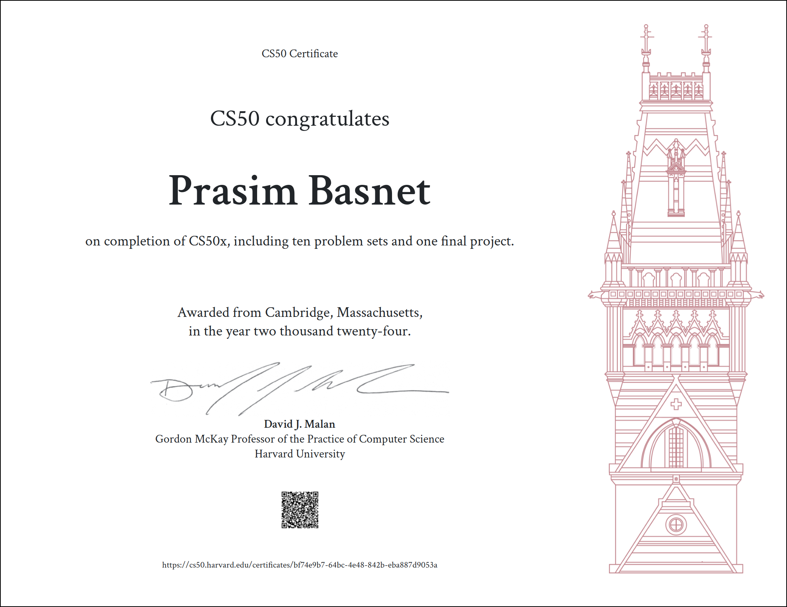

# 📓 CS50 Logbook – Completed & Certified

This repository is my complete journey through **Harvard University's CS50: Introduction to Computer Science**, including **all labs, problem sets, and my final project**.  
I completed the course and earned my **official certificate**.

---

## 📜 About the Course
CS50 is Harvard's legendary introduction to computer science, taught by **David J. Malan**.  
It covers:
- **C Programming** – syntax, pointers, memory management, file I/O
- **Algorithms** – searching, sorting, complexity analysis
- **Data Structures** – arrays, linked lists, hash tables, tries
- **Python** – scripting, problem-solving, automation
- **SQL** – relational databases
- **HTML, CSS, JavaScript** – web basics
- **Cybersecurity** – cryptography, forensics

---

## 📂 Repository Structure

| Folder / File               | Description |
|------------------------------|-------------|
| `.vscode/`                   | VS Code settings |
| `cs50/`                      | CS50 helper libraries |
| `filter-less/`               | Image filtering (less comfortable version) |
| `final project cs50/`        | My CS50 final project |
| `inheritance/`               | Lab on genetic inheritance simulation |
| `plurality/`                 | Plurality voting system |
| `python/`                    | Python problem sets |
| `recover/`                   | Forensic JPEG recovery |
| `runoff/`                    | Runoff voting system |
| `sort/`                      | Sorting algorithms |
| `speller/`                   | Spell checker using hash tables |
| `volume/`                    | WAV audio volume adjustment |
| `*.c`                        | Practice and lecture C programs |

---

## 🏆 Certificate
I have completed CS50 and earned the **CS50x Certificate of Completion** from HarvardX.

🎓 **[View My Certificate](https://cs50.harvard.edu/certificates/bf74e9b7-64bc-4e48-842b-eba887d9053a)**  

 

---

## 📚 Skills Gained
- Algorithmic thinking & problem decomposition
- C programming & memory management
- Debugging & testing code efficiently
- Python scripting & automation
- Database design & SQL queries
- Web fundamentals: HTML, CSS, JavaScript

---

## 📌 Final Note
This repository is for **educational and portfolio purposes**.  
If you are currently taking CS50, try solving the problems **yourself** before referring to solutions here.  
And remember — *"This is CS50!"* 🎓
